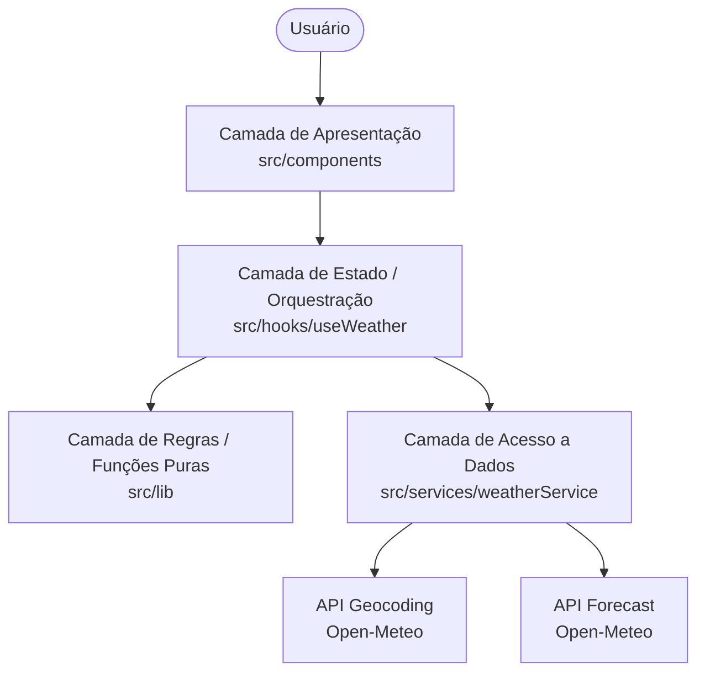
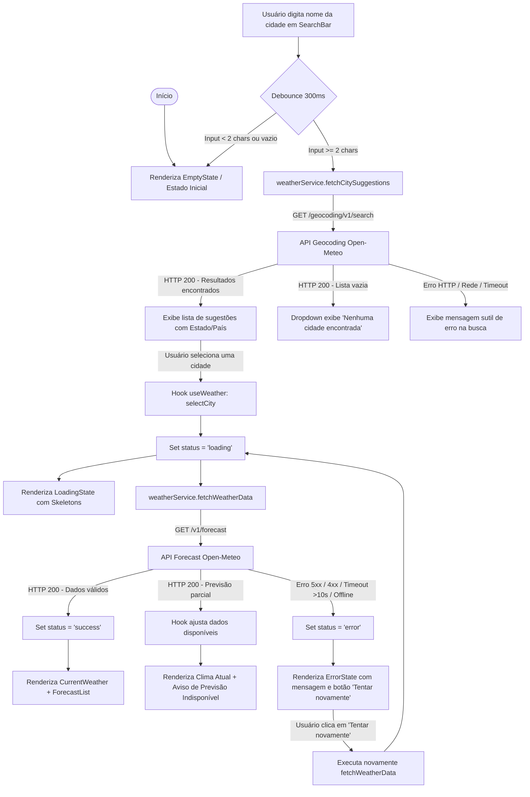
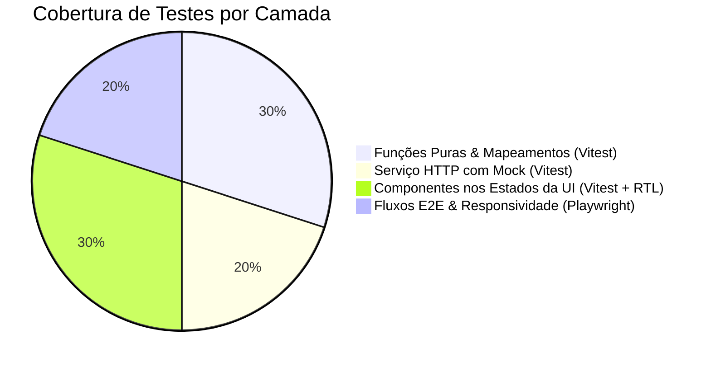

# Plano Técnico — Weather App

## Architecture Overview

A aplicação adota uma arquitetura em camadas orientada a componentes no React (SPA), priorizando a separação de responsabilidades, previsibilidade no fluxo de dados e facilidade de teste.



### Divisão de Camadas e Justificativa de Arquitetura:

1. **Apresentação (`src/components/`):**
   - **Responsabilidade:** Renderização declarativa de UI, captura de eventos de usuário e acessibilidade.
   - **Justificativa:** Mantém os componentes "burros" (presentational), focados unicamente em como a interface aparenta e responde a props.
   - **Facilidade de Teste:** Permite testes rápidos e isolados de componentes com React Testing Library (renderizar com mock de props e assertar texto/ARIA roles sem mockar requisições de rede).

2. **Orquestração e Estado (`src/hooks/`):**
   - **Responsabilidade:** Gerenciar estados reativos (`loading`, `error`, `success`, `idle`), ciclo de vida, alternância de unidades e conexão entre a UI e a camada de serviços.
   - **Justificativa:** Isola toda a regra de fluxo de dados do React fora da árvore de renderização visual.
   - **Facilidade de Teste:** Permite testar a máquina de estados e o fluxo assíncrono via `renderHook` da Testing Library sem depender de interface gráfica.

3. **Acesso a Dados (`src/services/`):**
   - **Responsabilidade:** Realizar chamadas HTTP (`fetch`), tratar respostas de API, configurar timeouts com `AbortController` e transformar/mapear DTOs externos para o modelo de dados da aplicação (`WeatherData`, `City`).
   - **Justificativa:** Desconecta a aplicação do fornecedor de dados. Se a API mudar ou for trocada no futuro, apenas o serviço é alterado.
   - **Facilidade de Teste:** Permite testar requisições, retries, erros 5xx/4xx e timeouts mockando apenas o `fetch` global no Vitest, sem necessidade de montar componentes React.

4. **Regras de Negócio e Funções Puras (`src/lib/`):**
   - **Responsabilidade:** Operações matemáticas e utilitários sem estado e sem efeitos colaterais (conversão de °C para °F, formatação de datas e mapeamento de códigos WMO para ícones).
   - **Justificativa:** Garante determinismo: para a mesma entrada, a saída é sempre idêntica.
   - **Facilidade de Teste:** Cobertura de testes unitários simples e ultra-rápidos (em milissegundos) no Vitest, sem necessidade de mocks ou ambiente DOM.

---

## Tech Stack

| Tecnologia | Função / Categoria | Justificativa |
| :--- | :--- | :--- |
| **TypeScript (Strict)** | Linguagem | Garante tipagem estática rigorosa, autocomplete e reduz erros de runtime em contratos de API. |
| **React 18 + Vite** | UI Framework & Bundler | Renderização declarativa performática, Fast Refresh no desenvolvimento e build estático rápido. |
| **Tailwind CSS** | Estilização | Permite criação ágil do tema *dark glassmorphism* e garante responsividade mobile-first com classes utilitárias. |
| **Vitest + Testing Library** | Testes Unitários e de Componente | Execução extremamente rápida de testes de funções puras, hooks e renderização de componentes React. |
| **Playwright** | Testes End-to-End (E2E) | Automação de navegadores reais para validação de fluxos completos do usuário em múltiplos viewports (Mobile/Desktop). |
| **Open-Meteo APIs** | Fonte de Dados Externa | API pública e gratuita para geocoding e dados meteorológicos, eliminando a necessidade de API Keys no cliente. |
| **Biome** | Linter e Formatação | Ferramenta integrada rápida para padronização e qualidade de código conforme as instruções do repositório. |

---

## Project Structure

```text
src/
├── components/          # Componentes React de UI (Apresentação)
│   ├── CurrentWeather.tsx
│   ├── ForecastCard.tsx
│   ├── ForecastList.tsx
│   ├── SearchBar.tsx
│   ├── UnitToggle.tsx
│   └── states/
│       ├── EmptyState.tsx
│       ├── ErrorState.tsx
│       └── LoadingState.tsx
├── hooks/               # Custom hooks (Estado e Orquestração)
│   └── useWeather.ts
├── lib/                 # Funções puras utilitárias (Sem efeitos colaterais)
│   ├── format.ts        # Formatação de datas e números
│   ├── temperature.ts   # Conversões Celsius <-> Fahrenheit
│   └── weatherCodes.ts  # Mapeamento de WMO Weather Codes para descrição/ícones
├── services/            # Serviços de integração HTTP com Open-Meteo
│   └── weatherService.ts
├── styles/              # Estilos globais e Tailwind
│   └── index.css
├── types/               # Tipos e interfaces compartilhados
│   └── weather.ts
└── App.tsx              # Componente raiz da aplicação

tests/
├── setup.ts             # Configuração global de testes (Vitest + Testing Library)
├── unit/                # Testes unitários de funções puras, serviços e componentes
│   ├── App.test.tsx
│   ├── format.test.ts
│   ├── SearchBar.test.tsx
│   ├── temperature.test.ts
│   ├── UnitToggle.test.tsx
│   ├── weatherCodes.test.ts
│   └── weatherService.test.ts
└── e2e/                 # Testes de integração E2E com Playwright
    └── weather.spec.ts
```

---

## Data Model

Contratos TypeScript principais para tipagem dos dados da aplicação (`src/types/weather.ts`), baseados nos dados fornecidos pela API Open-Meteo:

```typescript
/** Unidade de medida de temperatura suportada na interface */
export type Unit = 'celsius' | 'fahrenheit';

/** Representação de uma cidade obtida via Open-Meteo Geocoding API */
export interface City {
  id: number;           // Identificador único da cidade retornado pela Open-Meteo
  name: string;         // Nome da cidade (ex: "São Paulo")
  latitude: number;     // Coordenada de latitude para consulta de forecast
  longitude: number;    // Coordenada de longitude para consulta de forecast
  country: string;      // Nome do país (ex: "Brasil")
  state?: string;       // Estado ou região/província (admin1), se disponível
}

/** Dados meteorológicos do clima atual (Open-Meteo current) */
export interface CurrentWeather {
  temperature: number;   // Temperatura atual em Celsius (°C)
  weatherCode: number;   // Código meteorológico WMO (usado para mapear ícone e descrição)
  humidity: number;      // Umidade relativa do ar em porcentagem (%)
  windSpeed: number;     // Velocidade do vento em km/h (wind_speed_10m)
  pressure: number;      // Pressão atmosférica em hPa (surface_pressure)
  precipitation: number; // Volume atual de precipitação acumulada em mm
}

/** Dados da previsão meteorológica para um dia específico (Open-Meteo daily) */
export interface ForecastDay {
  date: string;              // Data no formato ISO (YYYY-MM-DD)
  tempMin: number;           // Temperatura mínima diária em Celsius (°C)
  tempMax: number;           // Temperatura máxima diária em Celsius (°C)
  weatherCode: number;       // Código WMO da condição predominante do dia
  windSpeed: number;         // Velocidade máxima do vento estimada para o dia em km/h
  precipitationProb: number; // Probabilidade máxima de chuva/precipitação em porcentagem (%)
}

/** Modelo completo compilado contendo a cidade e seus dados meteorológicos */
export interface WeatherData {
  city: City;               // Informações da cidade selecionada
  current: CurrentWeather;  // Condições climáticas atuais da cidade
  forecast: ForecastDay[];  // Lista da previsão de 5 dias (hoje + 4 dias subsequentes)
}

/** Estado operacional de dados e carregamento no hook useWeather */
export type WeatherStatus = 'idle' | 'loading' | 'success' | 'error';
```

---

## Data Flow



---

## External APIs

A aplicação integra duas APIs estáticas e públicas do provedor **Open-Meteo** (sem API Key).

### 1. Geocoding API (`https://geocoding-api.open-meteo.com/v1/search`)
- **Parâmetros:**
  - `name`: Nome da cidade pesquisada (ex: `"São Paulo"`).
  - `count`: `5` (limite máximo de sugestões).
  - `language`: `"pt"` (nomes em português quando disponível).
  - `format`: `"json"`.
- **Exemplo de Resposta Resumida:**
  ```json
  {
    "results": [
      {
        "id": 3448439,
        "name": "São Paulo",
        "latitude": -23.5475,
        "longitude": -46.6361,
        "country": "Brasil",
        "admin1": "São Paulo"
      }
    ]
  }
  ```
- **Mapeamento para o modelo `City`:**
  - `id` $\rightarrow$ `item.id`
  - `name` $\rightarrow$ `item.name`
  - `latitude` $\rightarrow$ `item.latitude`
  - `longitude` $\rightarrow$ `item.longitude`
  - `country` $\rightarrow$ `item.country`
  - `state` $\rightarrow$ `item.admin1` (opcional/fallback `undefined`)

### 2. Weather Forecast API (`https://api.open-meteo.com/v1/forecast`)
- **Parâmetros:**
  - `latitude`, `longitude`: Coordenadas geográficas da cidade selecionada.
  - `current`: `temperature_2m,relative_humidity_2m,weather_code,surface_pressure,wind_speed_10m,precipitation`
  - `daily`: `weather_code,temperature_2m_max,temperature_2m_min,wind_speed_10m_max,precipitation_probability_max`
  - `forecast_days`: `5`
  - `timezone`: `"auto"` (fuso horário local da coordenada)
- **Exemplo de Resposta Resumida:**
  ```json
  {
    "current": {
      "temperature_2m": 24.5,
      "relative_humidity_2m": 65,
      "weather_code": 0,
      "surface_pressure": 1013.2,
      "wind_speed_10m": 12.4,
      "precipitation": 0.0
    },
    "daily": {
      "time": ["2026-08-26", "2026-08-27", "2026-08-28", "2026-08-29", "2026-08-30"],
      "weather_code": [0, 1, 3, 61, 0],
      "temperature_2m_max": [26.0, 27.2, 22.0, 19.5, 25.0],
      "temperature_2m_min": [15.0, 16.1, 14.0, 12.0, 14.5],
      "wind_speed_10m_max": [15.2, 18.0, 21.1, 14.0, 10.5],
      "precipitation_probability_max": [0, 10, 40, 80, 5]
    }
  }
  ```
- **Mapeamento para o modelo `CurrentWeather` e `ForecastDay[]`:**
  - **`CurrentWeather`:**
    - `temperature` $\rightarrow$ `json.current.temperature_2m`
    - `weatherCode` $\rightarrow$ `json.current.weather_code`
    - `humidity` $\rightarrow$ `json.current.relative_humidity_2m`
    - `windSpeed` $\rightarrow$ `json.current.wind_speed_10m`
    - `pressure` $\rightarrow$ `json.current.surface_pressure`
    - `precipitation` $\rightarrow$ `json.current.precipitation`
  - **`ForecastDay[]` (iterando por índice `i` de `0` a `4`):**
    - `date` $\rightarrow$ `json.daily.time[i]`
    - `tempMin` $\rightarrow$ `json.daily.temperature_2m_min[i]`
    - `tempMax` $\rightarrow$ `json.daily.temperature_2m_max[i]`
    - `weatherCode` $\rightarrow$ `json.daily.weather_code[i]`
    - `windSpeed` $\rightarrow$ `json.daily.wind_speed_10m_max[i]`
    - `precipitationProb` $\rightarrow$ `json.daily.precipitation_probability_max[i]`

---

## State Management

A gestão de estado reativo vive centralizada no custom hook `useWeather` (`src/hooks/useWeather.ts`), eliminando a necessidade de bibliotecas complexas de estado global (como Redux ou Zustand).

### 1. Onde o estado vive:
- **Hook `useWeather`:** Mantém o estado dos dados meteorológicos, status operacional da requisição, lista de sugestões de autocompletar e unidade ativa.
- **Componente `SearchBar`:** Mantém apenas o estado local controlado do campo de texto de busca (`query`).

### 2. Estados explícitos da aplicação:
- **`idle` / `empty` (Estado Inicial / Vazio):** Nenhuma consulta de cidade foi realizada. Exibe o componente `EmptyState` instruindo o usuário a buscar por uma cidade.
- **`loading` (Estado de Carregamento):** Requisição à API de geocoding ou forecast em andamento. Renderiza o componente `LoadingState` (skeleton loaders no clima atual e cards de previsão), desabilitando re-submissões até a conclusão.
- **`success` (Estado de Sucesso):** Dados meteorológicos obtidos e validados. Renderiza os painéis `CurrentWeather` e `ForecastList`.
- **`error` (Estado de Erro Recuperável):** Falha de rede, timeout ou erro de servidor. Renderiza o componente `ErrorState` exibindo mensagem amigável em pt-BR e o botão de ação **"Tentar novamente"**.

### 3. Conversão Derivada de Celsius / Fahrenheit (sem requisição HTTP):
- Os dados brutos no estado (`weatherData`) são **sempre armazenados em Celsius (°C)**.
- O estado `unit` armazena a unidade ativa (`'celsius'` ou `'fahrenheit'`).
- Na renderização dos componentes (`CurrentWeather`, `ForecastCard`), os valores exibidos são **derivados em memória** através da função pura `convertTemperature(celsiusValue, unit)` da camada `lib/temperature.ts`.
- **Resultado:** A troca de unidade é síncrona e instantânea (< 16ms), **sem disparar nenhuma nova requisição HTTP** à API da Open-Meteo.

---

## Error Handling Strategy

A aplicação adota uma estratégia de resiliência em camadas contra exceções e comportamentos inesperados:

1. **Erros de Conexão e Rede (Offline / Connection Refused):**
   - Interceptados na camada de serviço (`weatherService.ts`). Caso o comando `fetch` falhe por perda de sinal ou ausência de conexão, é lançado um erro tratado: `"Sem conexão com a internet. Verifique sua rede e tente novamente."`, que altera o status do hook para `'error'`.

2. **Erros de Servidor e Status HTTP (5xx / 4xx / Rate Limit):**
   - Respostas de API com status diferente de 2xx são capturadas antes da conversão JSON. O erro é mapeado para uma mensagem humanizada: `"Serviço meteorológico temporariamente indisponível."`, evitando expor dados técnicos ou stack traces ao usuário final.

3. **Timeout em Requisições HTTP:**
   - As requisições utilizando `fetch` possuem um tempo limite configurado em **10 segundos** através da API `AbortController`.
   - Se a API demorar mais de 10s para responder, a requisição é cancelada e o estado muda para `'error'` exibindo: `"A requisição demorou muito para responder. Tente novamente."` juntamente com o botão de retry.

4. **Resposta Parcial ou Incompleta da API:**
   - Se a API retornar dados válidos para o clima atual mas a lista de previsão vier incompleta (menos de 5 dias):
     - A camada de serviço valida e ajusta a estrutura.
     - Se houver dias parciais disponíveis, os dias retornados são renderizados acompanhados de um aviso sutil de dados incompletos.
     - Se o array de previsão vier totalmente vazio, apenas o clima atual é exibido e a seção de previsão apresenta aviso de indisponibilidade temporária.
   - **Garantia:** Zero exceções não tratadas em runtime (*zero uncaught runtime exceptions*).

5. **Geocoding Sem Resultados / Cidade Inexistente:**
   - Se a API de geocoding retornar `results: []` para o termo pesquisado, o dropdown do autocompletar exibe `"Nenhuma cidade encontrada"`. Caso o usuário submeta o termo, a busca é bloqueada e o estado atual visual da tela é preservado.

---

## Testing Strategy

A estratégia de testes divide a verificação em duas camadas complementares (unidade/componente com Vitest e integração de ponta a ponta com Playwright), garantindo alta confiabilidade, resiliência e acessibilidade.



### 1. Testes Unitários e de Componente (`Vitest` + `React Testing Library`):

- **Funções Puras de Conversão e Formatação (`src/lib/`):**
  - `temperature.test.ts`: Validação de conversão de Celsius para Fahrenheit ($°F = °C \times 1.8 + 32$), arredondamento para inteiros e reversão de Fahrenheit para Celsius.
  - `format.test.ts`: Testar formatação de datas (ISO para dia da semana/data pt-BR) e exibição de decimais/porcentagens.
  - `weatherCodes.test.ts`: Mapeamento determinístico de todos os códigos WMO da Open-Meteo para nomes de condições meteorológicas e ícones correspondentes.

- **Serviço de Acesso a Dados (`src/services/`):**
  - `weatherService.test.ts`: Testar `fetchCitySuggestions` e `fetchWeatherData` mockando o `global.fetch`:
    - Resposta bem-sucedida (HTTP 200) e conversão de DTOs para o modelo `WeatherData`.
    - Erro de servidor (HTTP 500 / HTTP 429) e lançamento de exceção tratada.
    - Timeout de requisição via `AbortController` (após 10s).
    - Resposta sem resultados (`results: []`).

- **Componentes React por Estado da UI (`src/components/`):**
  - **Estado Vazio (`EmptyState`):** Renderizar mensagem inicial orientando a busca de cidades.
  - **Estado de Carregamento (`LoadingState`):** Renderizar indicadores visuais (spinners/skeletons) bloqueando novas ações.
  - **Estado de Erro (`ErrorState`):** Renderizar mensagem humanizada em pt-BR e verificar o callback do botão "Tentar novamente".
  - **Estado de Sucesso (`CurrentWeather` & `ForecastList`):** Renderizar métricas atuais (temperatura, vento, umidade, pressão, chuva) e cards da previsão de 5 dias.
  - **Interatividade (`SearchBar` & `UnitToggle`):** Testar acionamento do autocompletar via digitação, seleção por teclado (Enter/Esc) e alternância do seletor °C / °F.

---

### 2. Testes End-to-End e Responsividade (`Playwright`):

- **Fluxos E2E Cobertos (`tests/e2e/weather.spec.ts`):**
  - **Fluxo Principal de Busca:** Abrir a aplicação -> Digitar o nome de uma cidade ("São Paulo") -> Selecionar sugestão no dropdown -> Verificar atualização da interface com os dados do clima atual e a previsão de 5 dias.
  - **Alternância de Unidade:** Buscar uma cidade -> Clicar no botão `UnitToggle` (°C / °F) -> Verificar a atualização instantânea de todas as temperaturas exibidas na página sem recarregamento ou chamadas de rede.
  - **Recuperação de Erro (Resiliência):** Simular falha de rede/API -> Verificar exibição da tela de erro -> Clicar em "Tentar novamente" -> Confirmar recarregamento e exibição do estado de sucesso.
- **Validação de Responsividade:**
  - Execução automatizada da suíte E2E em viewports mobile (375x667 - iPhone SE / Galaxy) e desktop (1280x720).
  - Garantir ausência de rolagem horizontal indesejada e ajuste do layout dos cards de previsão.

---

## Risks & Trade-offs

| Decisão Técnica | Alternativa Considerada | Trade-off / Justificativa |
| :--- | :--- | :--- |
| **Uso da API Pública Open-Meteo (Sem API Key)** | APIs comerciais pagas (OpenWeatherMap, WeatherAPI) | **Vantagem:** Setup instantâneo, sem custos, sem expor chaves privadas no cliente e sem necessidade de proxy backend.<br>**Risco:** Ausência de SLA garantido e potenciais oscilações.<br>**Mitigação:** Tratamento robusto de erros HTTP, timeout via `AbortController` e botão de retry. |
| **Gerenciamento de Estado via Custom Hook (`useWeather`)** | Estado global com Redux Toolkit ou Zustand | **Vantagem:** Zero dependências extras, arquitetura enxuta e manutenibilidade simplificada.<br>**Risco:** Menos adequado para estados compartilhados em árvores muito profundas.<br>**Mitigação:** Como a aplicação possui um único fluxo de tela (SPA), o custom hook atende 100% dos requisitos sem over-engineering. |
| **Conversão de Unidade Client-side em Memória** | Refazer chamada de API parametrizada com `temperature_unit=fahrenheit` | **Vantagem:** Resposta instantânea (< 16ms) ao alternar unidades, reduzindo consumo de banda e carga na API (RNF1).<br>**Risco:** Necessidade de manter funções puras de conversão no frontend.<br>**Mitigação:** Funções puras em `src/lib/temperature.ts` totalmente cobertas por testes unitários via Vitest. |
| **Single Page Application (SPA) Estática com Vite + React** | Server-Side Rendering (SSR) com Next.js | **Vantagem:** Deploy estático extremamente barato e simples (GitHub Pages), build rápido.<br>**Risco:** Tempo de carregamento inicial dependente do download do bundle de JS.<br>**Mitigação:** Bundle de JS otimizado e reduzido (< 150KB gzipped) pelo Vite. |
